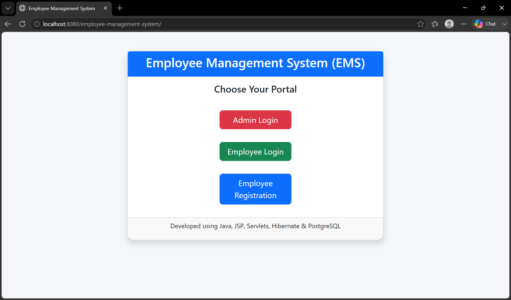
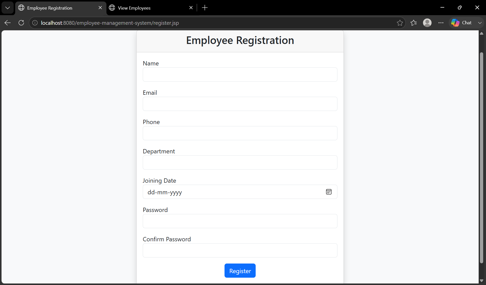
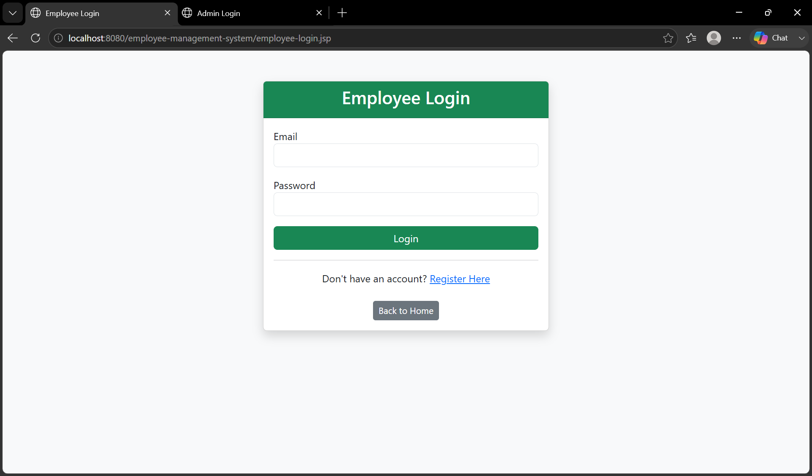
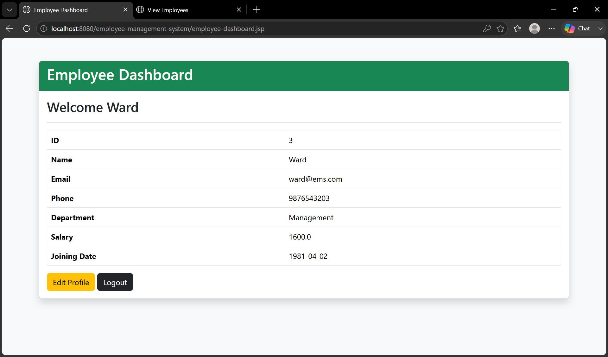
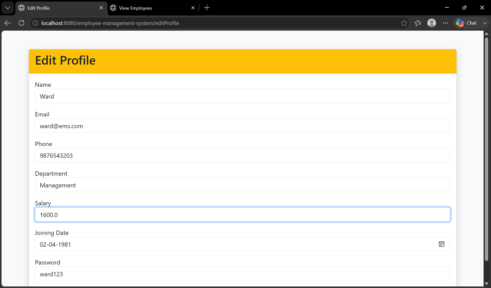
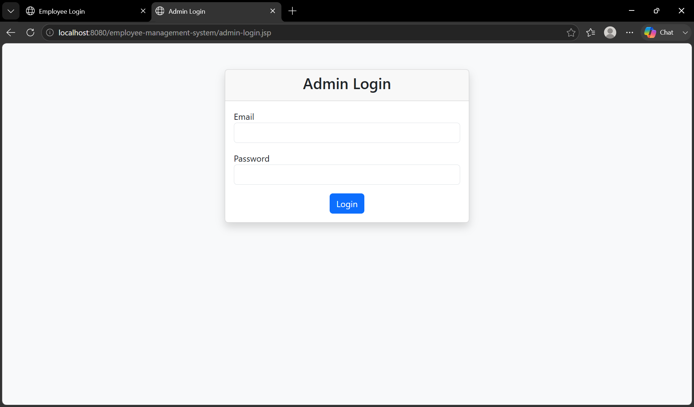
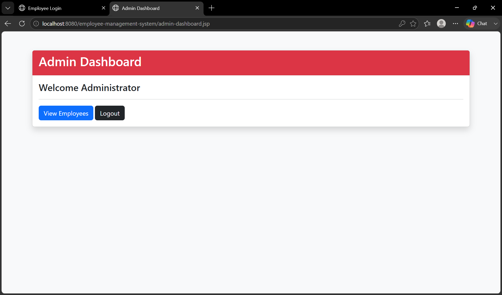
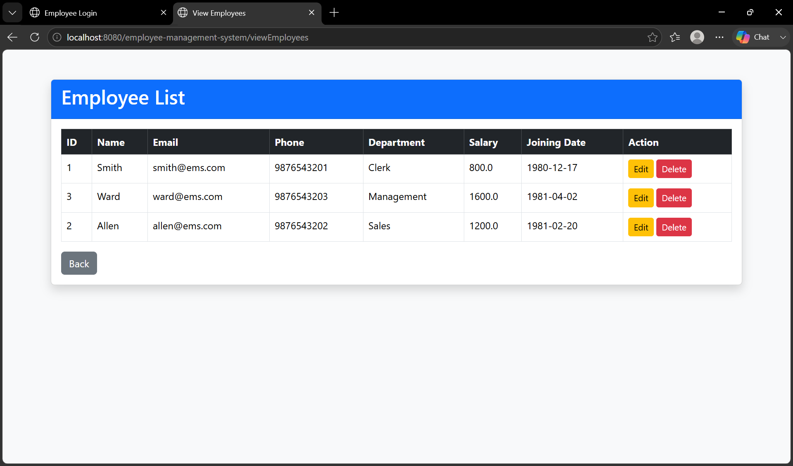
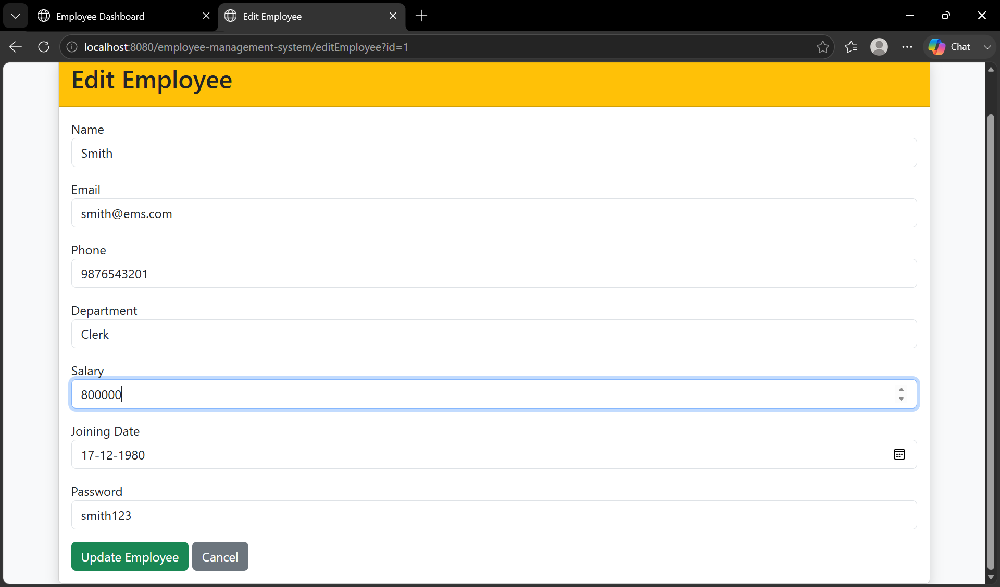

# Employee Management System

A role-based Employee Management System developed using Java, JSP, Servlets, JPA (Hibernate), PostgreSQL, and Maven. The application allows employees to register, log in, manage their profiles, while administrators can manage employee records through a secure dashboard.

---

## Features

### Employee
- Employee Registration
- Employee Login
- View Personal Dashboard
- Edit Personal Profile
- Update Profile Information
- View Salary (Read-Only)
- Logout

### Admin
- Admin Login
- View All Employees
- Edit Employee Details
- Update Employee Salary
- Delete Employee Records
- Logout

---

## Tech Stack

- Java
- JSP
- Servlets
- JPA (Hibernate)
- PostgreSQL
- Maven
- Apache Tomcat
- HTML
- CSS
- Bootstrap 5
- Git & GitHub

---

## Project Architecture

MVC (Model-View-Controller)

```
Browser
   │
   ▼
JSP (View)
   │
   ▼
Servlet (Controller)
   │
   ▼
DAO (Model)
   │
   ▼
PostgreSQL Database
```

---

## Project Structure

```
src
│
├── com.ems.entities
│      ├── Employee.java
│      └── Admin.java
│
├── com.ems.dao
│      ├── EmployeeDAO.java
│      └── AdminDAO.java
│
├── com.ems.servlets
│      ├── RegisterServlet.java
│      ├── LoginServlet.java
│      ├── LogoutServlet.java
│      ├── EditProfileServlet.java
│      ├── UpdateProfileServlet.java
│      ├── ViewEmployeesServlet.java
│      ├── EditEmployeeServlet.java
│      ├── UpdateEmployeeServlet.java
│      └── DeleteEmployeeServlet.java
│
└── com.ems.util
       └── JPAUtil.java
```

---

## Database

### Employee Table

| Column | Type |
|---------|------|
| id | Integer |
| name | String |
| email | String |
| phone | String |
| department | String |
| salary | Double |
| joiningDate | Date |
| password | String |

### Admin Table

| Column | Type |
|---------|------|
| id | Integer |
| name | String |
| email | String |
| password | String |

---

## Application Flow

### Employee

```
Register
     ↓
Login
     ↓
Employee Dashboard
     ↓
Edit Profile
     ↓
Update Profile
     ↓
Logout
```

### Admin

```
Admin Login
      ↓
Admin Dashboard
      ↓
View Employees
      ↓
Edit Employee
      ↓
Delete Employee
      ↓
Logout
```

---

## Key Functionalities

- Employee Registration
- Session-Based Authentication
- Role-Based Access Control
- CRUD Operations
- Employee Self-Service
- Admin Management Module
- Secure Logout using HttpSession
- JPA/Hibernate Database Integration
- MVC Architecture

---

## Screenshots

### Home Page


### Employee Registration


### Employee Login


### Employee Dashboard


### Edit Profile


### Admin Login


### Admin Dashboard


### View Employees


### Edit Employee


---

## Future Enhancements

- Password Encryption using BCrypt
- Forgot Password
- Search Employees
- Pagination
- Email Notifications
- Profile Picture Upload
- Validation using JavaScript
- Spring Boot Migration
- REST API Integration

---

## Learning Outcomes

Through this project, I gained hands-on experience with:

- Java Web Development
- JSP and Servlets
- MVC Architecture
- JPA (Hibernate)
- PostgreSQL Database
- Session Management
- CRUD Operations
- Git & GitHub
- Maven Project Structure

---

## Author

**Harshitha M**

Computer Science Engineering Student

Java Full Stack Developer
